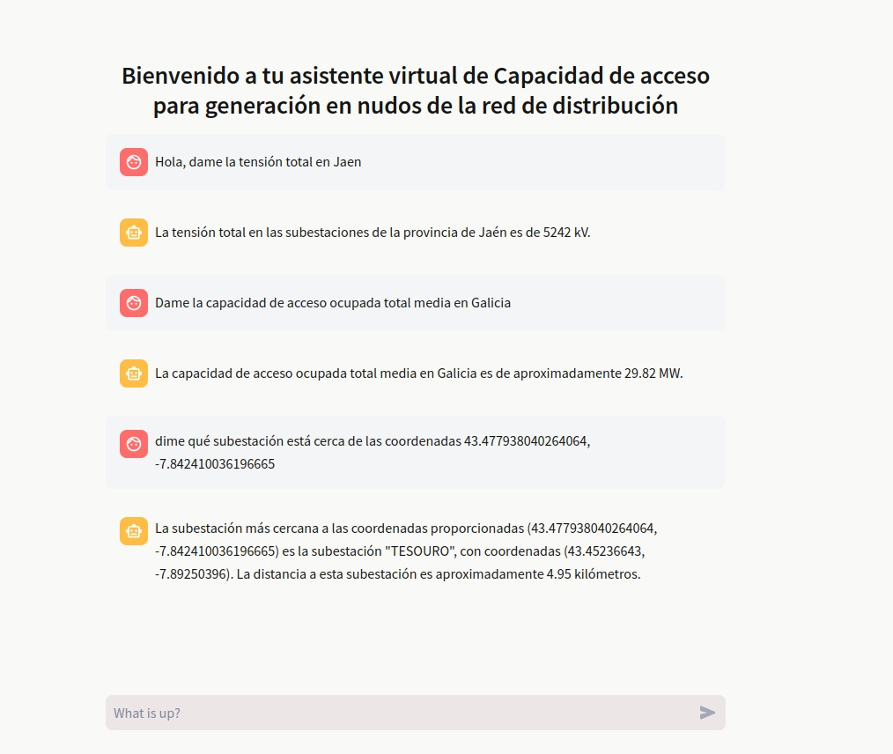

# Access Capability Virtual Assistant
Welcome to the Access Capability Virtual Assistant project! This virtual assistant is implemented in Python and utilizes Generative AI to assist users in retrieving information about the Access capability for generation at nodes of the distribution network operated by electricity suppliers.

## Overview
Electricity suppliers often provide crucial information regarding Access capability for generation at various nodes of the distribution network on their websites. However, this information is typically embedded within PDF files, often presented in tabular format across multiple pages. The Access Capability Virtual Assistant automates the process of extracting this information, converting it into usable formats such as JSON and CSV, and provides a user-friendly interface for querying this data.

## Features
- **Web Scraping**: The application utilizes the BeautifulSoup library to scrape websites of electricity suppliers and retrieve PDF files containing relevant information.

- **PDF Parsing**: The PDF files are processed using the pdfplumber library to extract data from tables across multiple pages efficiently.

- **Data Conversion**: Extracted information is converted into JSON and CSV formats for easy storage and manipulation.

- **Embedding Model Integration**: An embedding model provided by OpenAI is used to generate embedding vectors that power the OpenAIAssistant library, facilitating natural language understanding and interpretation.

- **Chatbot Interface**: The core functionality is wrapped in a web application developed with Streamlit, providing users with a chatbot interface to interactively query the extracted information.

## Installation
To install and run the Access Capability Virtual Assistant, follow these steps:

1. Clone the repository:

```bash
git clone https://github.com/yourusername/access-capability-virtual-assistant.git
```
2. Navigate to the project directory:

```bash
cd access-capability-virtual-assistant
```

3. Install the required dependencies:

```bash
pip install -r requirements.txt
```

## Usage
Before starting the web application, ensure that you execute the scraper script to retrieve the necessary data. The scraper script is located at src/scraper.py. Follow these steps to run the scraper:
```bash
python src/scraper.py
```
This will initiate the web scraping process to gather the required PDF files from the electricity suppliers' websites.

Once the scraping is complete, you can start the web application by running:
```bash
streamlit run app.py
```

This will launch the web interface where users can interact with the chatbot to inquire about Access capability information.

## Example


